<div align="center">


### Per-project token analytics for AI coding tools, with a pixel mascot living in the notch.

macOS&nbsp;14+ · SwiftUI · zero dependencies · nothing leaves your machine

</div>

---

Every token tracker answers *"how many tokens did I burn?"* Perch answers the
question that actually matters: **which project cost what, on which models, on
which days**. It lives in the notch, so it is always a glance away.

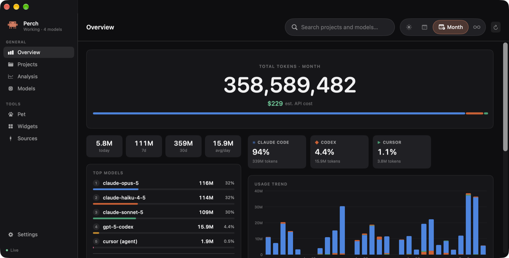

## In the notch

A shelf hugs the cutout and extends it downward: mascot, today's tokens, streak
and a 14-day sparkline, all readable without hovering:

<div align="center">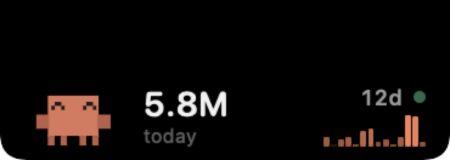</div>

Hover and it expands into today's figures, the busiest project, and a per-tool
split. It hides itself whenever an app goes full-screen, so it never covers
full-screen content:

<div align="center">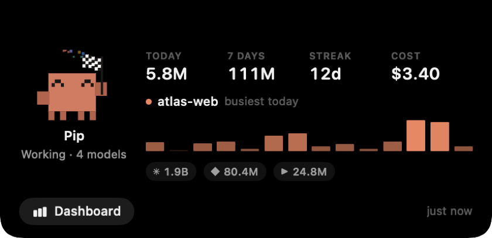</div>

## What it does

- **Rides the notch.** A shelf hugs the cutout and extends it downward: mascot,
  live token count, streak, and a 14-day sparkline, all readable without hovering.
  Hover to expand, and it hides itself whenever an app goes full-screen.
- **Project-first.** Every view pivots on project. Totals are the roll-up, not the
  point.
- **Reads four tools.** Claude Code, Codex CLI, Cursor, and Antigravity, all
  read-only and all local.
- **Analysis that earns its name.** Cache efficiency, subagent delegation, working
  rhythm by hour, and week-over-week momentum, each scopeable to a single project.
- **Five desktop widgets** in the real macOS size families.
- **A mascot driven by your actual activity**, not a timer.

## Install

```bash
git clone https://github.com/Manukrish2504/Perch.git
cd Perch
./build.sh
open build/Perch.app
```

Requires **macOS 14+** and the Swift toolchain from Command Line Tools
(`xcode-select --install`). No Xcode, no package manager, no dependencies.

There is no Dock icon, because Perch is an accessory app. **Right-click the shelf** for
Open Dashboard / Rescan / Quit.

> **Just want to look around?** `PERCH_DEMO=1 ./build/Perch.app/Contents/MacOS/Perch`
> runs the whole app on generated data without reading a single real log. Every
> screenshot in this README is that mode.

## The mascot

The mascot is a rig of rectangles (body, eyes, two hands, four legs), each
independently transformable and driven by a small tween engine. Which animation plays
is decided by your real usage, never a timer.

| | | |
|:--:|:--:|:--:|
|  |  |  |
| **Calm**: leans, looks around | **Focused**: a request in the last 6 min | **Working**: a request in the last 90s |
| 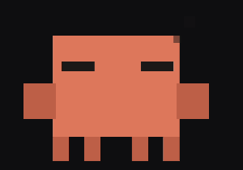 | 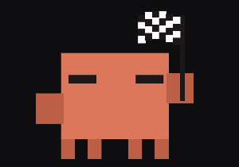 | 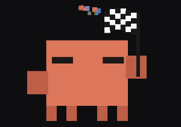 |
| **Resting**: nothing for 45 min | **Streak**: 3 days or more | **Multi-model**: 2+ models today |

Opening the dashboard plays a run, and **the mascot is the progress bar**. It
paces the real scan and lays the track down behind it.

<div align="center"></div>

Five palettes on one rig, so they all walk, lean and jump the same way:

| Pip | Sprig | Byte | Ember | Nimbus |
|:--:|:--:|:--:|:--:|:--:|
|  | 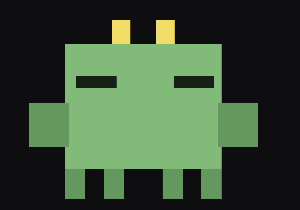 | 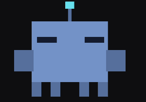 |  | 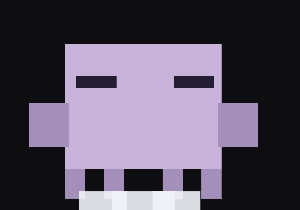 |

Regenerate these with `./docs/make-gifs.sh`. The frames are rendered by the app
itself, so they can never drift from the shipped animations.

## Screens

### Projects
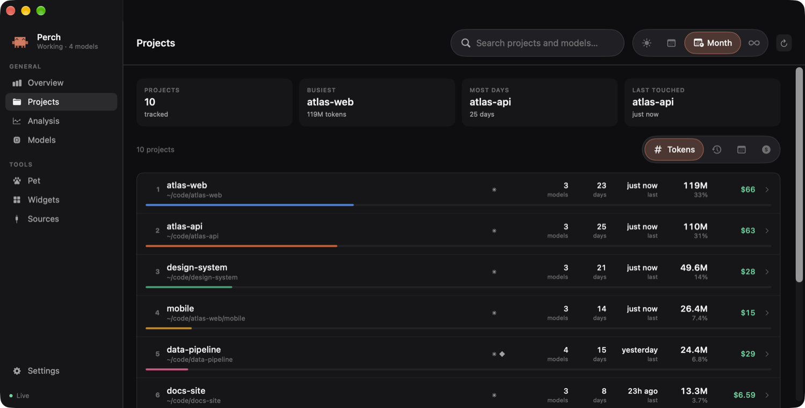

### Analysis
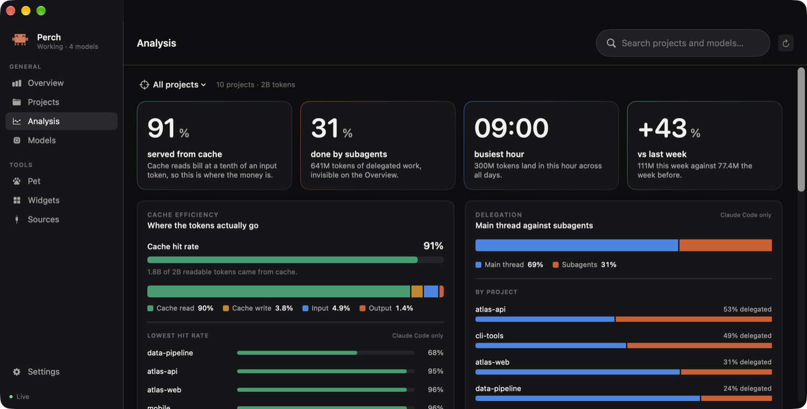

Four questions the overview cannot answer, each scopeable to one project:

- **Cache efficiency.** A cache read bills at a tenth of an input token, so on a
  cache-heavy setup this is where nearly all the money is. Ranked worst-first,
  because a list of projects already at 99% gives you nothing to do.
- **Delegation.** Main thread against subagents. Typically a sixth of the tokens
  and near half the requests, and invisible everywhere else.
- **Working rhythm.** Tokens by hour of day, peak emphasised.
- **Momentum.** The last 7 days against the 7 before, per project.

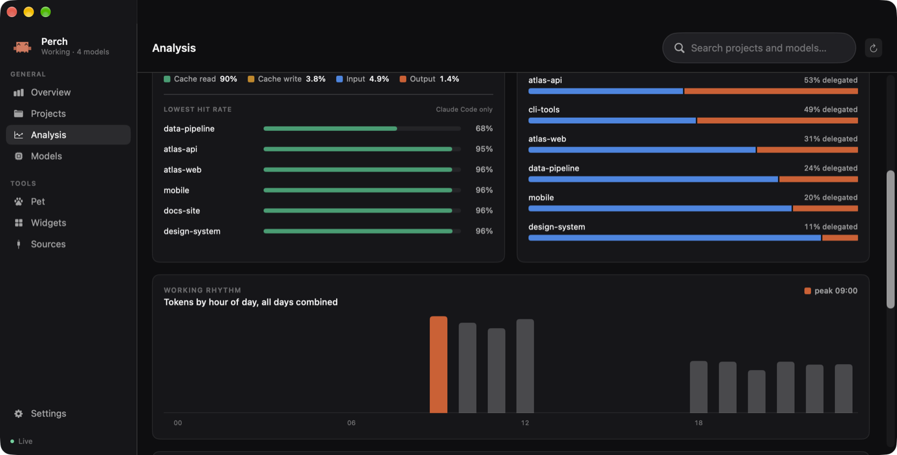

### Pet and widgets
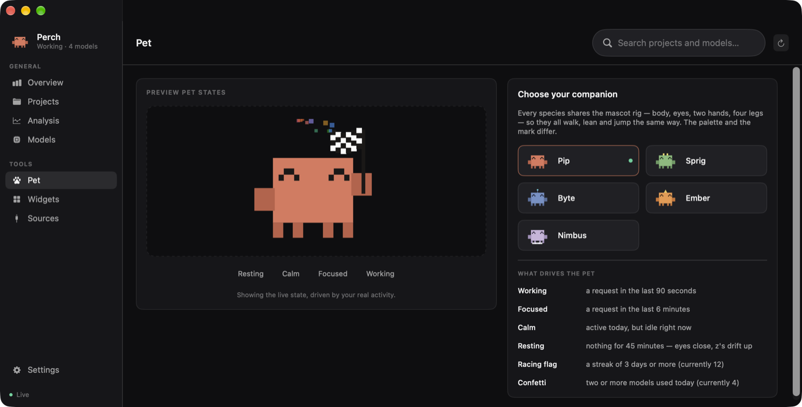
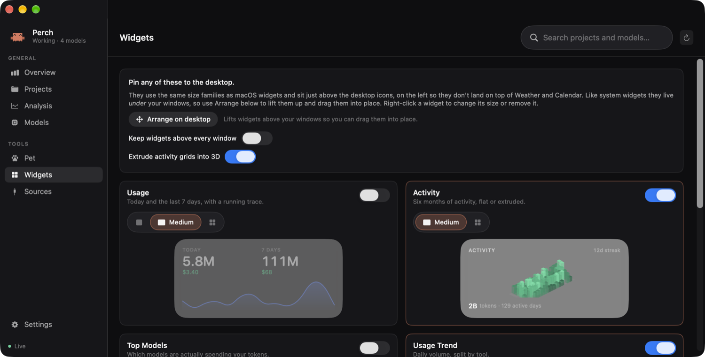

## What each source gives you, honestly

| Tool | Reads | Limits |
|---|---|---|
| **Claude Code** | `~/.claude/projects/**/*.jsonl`: per-message model, full token split, working directory, subagent flag | None. The richest source. |
| **Codex CLI** | `~/.codex/sessions/**/rollout-*.jsonl`: cumulative counters, model from turn context | Codex re-emits its counters on every stream tick. Summing per-turn rows over-counts by **~2.5×**, so Perch differences the cumulative total instead. |
| **Cursor** | `state.vscdb`: per-conversation input/output, dated via `composerData` | Cursor records **no model name** locally, so usage is grouped as `cursor (agent/chat)`. Most conversations record no folder, so they land in *Unattributed* rather than a guessed project. |
| **Antigravity** | `~/.gemini/antigravity*/brain/**/*.jsonl` | Only writes token counts in some configurations. The adapter reports why it is empty rather than showing a silent zero. |

Cache and subagent data come from Claude Code alone, so those panels say so
instead of letting a diluted denominator read as a real finding.

## Cost

Costs are **estimated API cost**, not what you were billed. A subscription is not
per-token. Anthropic rates are the published ones; others are estimates and are
tagged `est` in the UI. Every rate is editable in Settings and saved to
`~/Library/Application Support/Perch/rates.json`.

## Privacy

Perch opens every file read-only and SQLite in read-only mode. It installs no
hooks, edits no other tool's config, **makes no network calls**, and never parses a
prompt or a response. It reads only counts, model ids, paths and timestamps. The only
directory it writes to is its own under Application Support.

## Architecture

```
Sources/Perch/
├── Model/      UsageEvent · Rollup aggregates · PriceBook · LimitWindow
├── Ingest/     one adapter per tool + incremental scan coordinator + demo data
├── Notch/      geometry, the above-menu-bar NSPanel, hover, shelf UI
├── Widgets/    desktop panels, the five widget cards, placement
├── Pet/        mascot rig, tween engine + timelines, Canvas renderer
├── Dashboard/  sidebar shell and every tab
└── Support/    theme tokens, formatting, SQLite reader, logging
```

Conventions live in [`agent-os/standards/`](agent-os/standards/). The notch
window rules, the validated chart palette, the mascot rig, and the source-adapter
contract are all written down there, including the measurements behind them.

## Notes for contributors

- **`swift build` is unusable here.** The Command Line Tools ship a
  `PackageDescription` whose interface and dylib disagree, so no manifest parses.
  `build.sh` calls `swiftc` directly and assembles the `.app` by hand.
- **`@State` is a compiler macro in the macOS 27 SDK** and its plugin ships only
  with full Xcode. `Support/Local.swift` is a drop-in replacement; use `@Local`.
  It is built on `@StateObject`, because a bare `State(initialValue:)` compiles but
  does not get stable per-view storage.
- **Settings decode key-by-key** with per-key fallbacks. Swift's synthesised
  `Codable` throws on a missing key *even when the property has a default*, so
  adding a setting would otherwise silently reset everyone's saved config.
- Handy flags: `PERCH_DEMO=1` (generated data), `PERCH_TAB=analysis` (open to a
  tab), `PERCH_DEBUG=1` (hover/geometry logging),
  `PERCH_RENDER_MASCOT=<dir>` (write animation frames).

## Credits

The mascot's rig and animation timings follow
[this breakdown of Claude's mascot animations](https://tympanus.net/codrops/2026/05/05/reverse-engineering-claude-ais-mascot-animations-with-svg-and-gsap/)
by Ayotomiwa Wale-Durojaye.

## License

[MIT](LICENSE)
